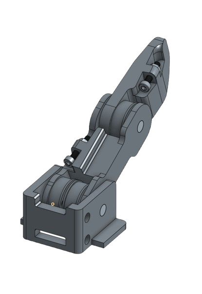
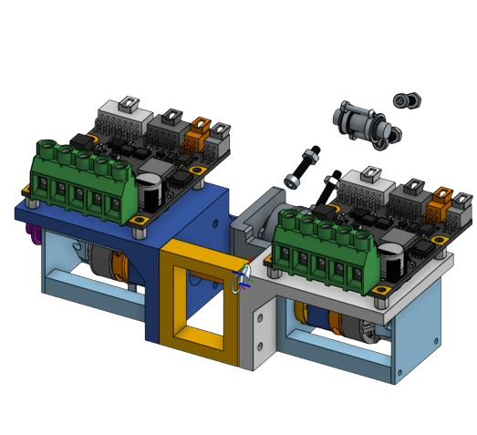

<div align="center">
  
  
</div>

# team-n-testbench

A warm-up project for RDS, involving the creation of a "testbench," which is a robotic finger driven with `N` tendon-driven actuators. The scope of the project involves:

* Desinging the mechanical structure of the finger, including tendon routing, manufacturing, and assembly
* Designing the electrical control system, including the motor drivers, microcontroller, and sensors
* Designing the software control system, including the GUI, motor control, and sensor feedback

This repository contains all of the software for the project, detailed below.

## Repository structure

* `gui/` - GUI software for the project, which is written in Python
* `testbench-mcu/` - A platformio project for a teensy 4.1, which is the microcontroller for the project, and contains all the code for interfacing with the motor drivers and sensors, and communicating with the GUI
* `docs` - Documentation for the project, including datasheets, schematics, and other important information

## Requirements & Installation

### General

To clone the repository, run the following command, which not only clones the repository but also initializes the submodules:

```bash
git clone --recurse-submodules
```

We depend on the `rdscom` library, which is a library written by team N that controls communication between the GUI and the MCU. See the [rdscom repository](https://github.com/evan-bertis-sample/rdscom) for more information.

### GUI
For the GUI all you need is Python 3.7. To install the required packages, run the following command:

```bash
cd gui
python -m venv venv # create a virtual environment
source venv/bin/activate # activate the virtual environment
pip install -r requirements.txt # install the required packages
```
To run the GUI, simply run the following command:

```bash
python gui.py
```

You can specify the port that the GUI will connect to the MCU on by passing the `--port` argument. For example, to connect to the MCU on port `/dev/ttyACM0`, run the following command:

```bash
python gui.py --port /dev/ttyACM0
```

### MCU
For the MCU, you will need to install PlatformIO. To install PlatformIO, run the following command. Follow the instructions on the website to install the IDE extension for your preferred IDE.

## Important Documentation

* [Messages](docs/messages.md) - A list of all the messages that can be sent between the GUI and the MCU. We use the `rdscom` library to send these messages, if you want to learn more about the library, see the [rdscom repository](https://github.com/evan-bertis-sample/rdscom).